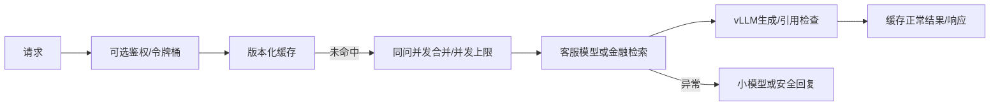

## 全链路补充（2026-10-08）

新增真实 vLLM JSON 的 SLO审计、文件 SHA-256 与最佳观测配置筛选。历史短测不能证明最大可持续吞吐，见 [SLO审计](docs/SLO_AUDIT.md)。

## 原帖路线更新（2026-10-05）

本仓库是当前原帖路线版本；最新配置、执行命令和未完成项见 [docs/ORIGINAL_ROUTE.md](docs/ORIGINAL_ROUTE.md)。2026-10-06 已在 RTX 4080 SUPER 32GB 上完成 Qwen3-8B FP16 vLLM 服务、并发 1/4/8/16 基准及 prefix cache 开关对照；原始 JSON、启动日志和 `nvidia-smi` 记录位于 `results/`。

# 客服与金融 RAG 统一推理网关

FastAPI 统一客服和金融问答路由，提供限流、超时、缓存、并发合并、熔断、降级、Prometheus 指标、HTTP 压测及故障演练。支持 vLLM OpenAI-compatible 后端和 Redis 缓存。

**当前包含两类不可混用的结果：Windows CPU 网关/缓存工程测试，以及 Linux GPU 上的 Qwen3-8B vLLM 生成基准。** 金融路由使用项目二真实检索和证据摘录；GPU 基准使用 vLLM 自带 `bench serve`，并保存逐请求明细。
CPU 网关 QPS、P95 不能写成 Qwen3-8B/vLLM 性能；模拟 OOM 不是在显卡上制造 OOM。

## 安装与串联演示

独立网关可以只安装本仓库。要一起运行金融链路，将 financial-report-rag 放在同级目录：

```sh
python -m venv .venv
# Windows PowerShell: .venv/Scripts/Activate.ps1
# Linux/macOS: source .venv/bin/activate
python -m pip install -r requirements.txt
python -m pip install -e ../financial-report-rag
python -m pytest -q
python scripts/run_demo.py
```

金融 demo：http://127.0.0.1:8001；网关 API：http://127.0.0.1:8002/docs。Ctrl+C 会停止启动器创建的两个服务。默认仅绑定本机。
也可分别在两个终端启动 finrag.api:app（8001）和 gateway.service:app（8002）。

若要串联项目一的实际微型训练产物，先在同一虚拟环境安装 `../ecommerce-alignment[trl-smoke,serve,eval]`，进入电商目录运行 `python -m ecom.trl_smoke`，再回网关目录运行 `python scripts/run_demo.py --tiny`。等待三个服务各自报告启动完成后，运行 `python scripts/verify_cpu_model.py`。测试使用 refund 英文问题，返回真实 tiny 模型 token usage；金融生成无法验证引用时会退回原证据。结果见 results/tiny-model-integration.json，不代表有可用的 8B 客服效果。

```sh
curl -X POST http://127.0.0.1:8002/ask -H "Content-Type: application/json" -d '{"query":"退货怎么办？","task":"customer"}'
```

Windows 建议在 /docs 页面提交中文请求。task 可以显式指定 customer/finance；auto 是关键词演示路由，不是训练后的意图模型。query 最长 2000 字符。

## 请求链路与边界



- 内存缓存有容量上限和 TTL；Redis 连接超时有界，缓存不可用时继续服务。
- key 包含模型、语料版本、后端、任务和问题；更新模型或语料必须更新 MODEL_CORPUS_VERSION。
- 仅适用于共享、无个人上下文的问答；当前没有租户隔离、订单权限或会话记忆，不能直接接入个人订单查询。
- 令牌桶为进程全局；同问并发合并与熔断为单进程。多 worker/多副本生产部署需要 Redis 等分布式协调。
- 截止时间涵盖等待并发槽、检索与主模型生成。后台客户端断开不会取消其他同问请求共享的任务。
- 三次故障后短暂熔断；降级结果不写入热点缓存。可配置 FALLBACK_URL/FALLBACK_MODEL 调用小模型，否则安全转人工。
- 长度截断视为失败；金融引用检查采用保守的原文摘录约束。存在合法引用编号也不等于事实正确，因此无法验证的生成退回原证据。
- /metrics 输出请求状态和延迟；日志记录 request_id、latency_ms、status，不记录问题正文。模型 usage 原样返回，可用于 token 指标；mock 不生成伪 token 数。
- /health 是网关存活检查，不代表全部依赖健康。API_KEY 配置后 /ask 校验 Bearer token；公网部署还需要 TLS、受控监控端点与完整身份体系。

## 缓存、压测与故障演练

```sh
python scripts/benchmark.py --concurrency 8 --requests 100 --output results/my-unique.json
python scripts/benchmark.py --concurrency 8 --requests 100 --hot --output results/my-hot.json
python scripts/fault_drill.py
```

每轮压测生成独立查询前缀避免前一轮缓存污染；hot 的同问请求会命中缓存或合并。QPS 计算仅统计 HTTP 200 且未降级请求；P50/P95/P99 包含所有已完成请求，并记录错误/降级率。客户端信号量等待不计入请求延迟，服务端排队计入；这是闭环压测，不是开放到达率压测。默认生产演示限流会影响结果，本机报告提高限流上限后单独验证并发行为。

现有结果覆盖并发 1/4/8/16/32、冷热两种 workload，每组 100 次真实 loopback HTTP 请求；上游 mock 等待 20ms。Windows 调度、客户端和服务日志均会影响结果，没有多次重复的置信区间，不能当成部署容量承诺。raw rows 与环境保留在 results/。

Redis 的部署示例为 compose.yaml；本机没有 Docker/Redis 服务，因此只提供连接实现和故障单测，不声称 Redis 命中率实测。

## 真模型部署与量化

先在项目一合并策略适配器。Linux CUDA 推理环境：

```sh
python -m pip install -r requirements-gpu.txt
python scripts/serve_vllm.py --model ../ecommerce-alignment/artifacts/merged-model
# 添加 --execute 实际启动；默认只显示将执行的参数。
```

配置 BACKEND=vllm、MODEL_URL、MODEL、RAG_URL；可参考 configs/gpu.env.example。环境文件只是示例，需要手动加载为环境变量；程序不会自动读取 .env。
FP16 基线应来自同一合并模型。量化在另一个环境安装 requirements-quantization.txt，参考：

```sh
python scripts/quantize.py --model ../ecommerce-alignment/artifacts/merged-model --data ../ecommerce-alignment/artifacts/data/train.jsonl --scheme awq --samples 128 --output artifacts/awq
python scripts/quantize.py --model ../ecommerce-alignment/artifacts/merged-model --data ../ecommerce-alignment/artifacts/data/train.jsonl --scheme gptq --samples 128 --output artifacts/gptq
python scripts/quantize.py --model ../ecommerce-alignment/artifacts/merged-model --data ../ecommerce-alignment/artifacts/data/train.jsonl --scheme int8 --samples 128 --output artifacts/int8
```

默认旧样例不足 128 条；运行项目一 build_synthetic.py 后得到 160 条训练样例。它们是合成规则数据，不能声称是真实业务校准集。AWQ/GPTQ 产物采用 compressed-tensors 格式，serve_vllm.py 使用 auto 或 compressed-tensors 检测，不能仅因算法叫 AWQ 就强行使用 legacy awq loader。
Qwen3-8B FP16 vLLM 已在 RTX 4080 SUPER 32GB 上运行并完成并发与 prefix-cache 对照；量化模型的安装、兼容性和质量仍需另行验证，当前没有 AWQ/GPTQ/INT8 实验结论。

量化对比必须使用同一 checkpoint、独立评测集、相同生成参数、长度分布和并发。用项目一 predict/evaluate 收集效果，benchmark 收集 HTTP 性能，gpu_monitor.py 收集总设备显存；记录量化模型体积。INT8 表示 W8A8 整数，不是 FP8。所有未运行数值在 experiments/quantization-template.csv 中保持空值。

KV cache 估算脚本使用 GQA 的 KV heads：2 × layers × kv_heads × head_dim × tokens × batch × precision_bytes。它不包括分页浪费、模型权重或工作区，不能替代显存实测。

## 文件与证据

src/gateway/service.py：网关；scripts/：压测、演练、部署、量化与显存采集；tests/：缓存、并发、超时、熔断、引用、限流及兜底；results/：真实本机记录。说明见 [docs/EXPERIMENTS.md](docs/EXPERIMENTS.md)、[docs/BADCASES.md](docs/BADCASES.md) 和 [docs/GITHUB.md](docs/GITHUB.md)。

原生压测：`benchmark_vllm.py` 覆盖 1–32 并发，`--prefix-len 128` 用于共享前缀工作负载；请给每种服务配置设置不同 `--run-id` 并保存实际服务启动命令。FP16 服务默认 `--dtype half`。真实 Redis 基准：`benchmark_redis.py`，连接失败不会产生伪性能结果。
